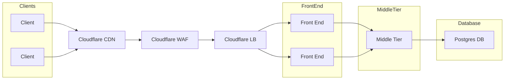
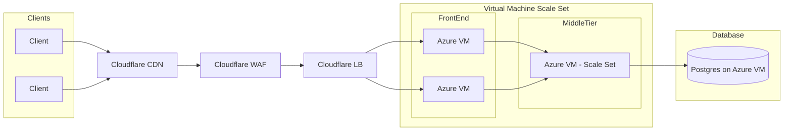
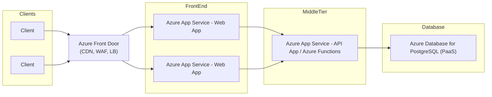

 # Application consists of a Web Server written in Flask. A UI front end written in React. A database layer consisting of Postgres.
 
 

## ON PREM

 

1) **Clients**: user's accessing the app. Can be multiple users for anywhere in the world
2) **Content Delivery**
   - [Cloudflare CDN](https://www.cloudflare.com/application-services/products/cdn/): handles global content delivery, 
3) **Firewall**
   - [Cloudflare WAF](https://www.cloudflare.com/application-services/products/waf/) is a Web Application firewall. 
4) **Load Balancer**
    - [Cloudflare Load Balancing](https://www.cloudflare.com/application-services/products/load-balancing/) handles load balancing 
5) **Front End and Middle Tier**
    - Built on on prem servers.
6) **Database**
    - Deploy PostgreSQL on an on prem server. 

 
 

## Azure and CloudFront IAAS Architecture

 

1) **Clients**: user's accessing the app. Can be multiple users for anywhere in the world
2) **Content Delivery**
   - [Cloudflare CDN](https://www.cloudflare.com/application-services/products/cdn/): handles global content delivery, 
3) **Firewall**
   - [Cloudflare WAF](https://www.cloudflare.com/application-services/products/waf/) is a Web Application firewall. 
4) **Load Balancer**
    - [Cloudflare Load Balancing](https://www.cloudflare.com/application-services/products/load-balancing/) handles load balancing 
5) **Front End and Middle Tier**
    - [Azure Virtual Machine](https://azure.microsoft.com/en-us/products/virtual-machines): for building, deploying and running the web apps. Built in [Virtual Machine Scale Set](https://learn.microsoft.com/en-us/azure/virtual-machine-scale-sets/overview) for scaling.
6) **Database**
    - Deploy PostgreSQL on a VM. 

**NOTE**: tried using none Azure tools to avoind vendor lockin. 
 
 

## Azure PAAS Architecture

 

1) **Clients**: user's accessing the app. Can be multiple users for anywhere in the world
2) **Content Delivery, Firewall and Load Balancing** 
   - [Azure Front Door](https://learn.microsoft.com/en-us/azure/frontdoor/front-door-overview): is a **fully managed SaaS** that handles global content delivery, [firewall](https://learn.microsoft.com/en-us/azure/web-application-firewall/afds/afds-overview) (integrated with Azure Web Application firewall) and [load balancing](https://learn.microsoft.com/en-us/azure/architecture/guide/technology-choices/load-balancing-overview)
3) **Front End**
    - [Azure App Service](https://azure.microsoft.com/en-us/products/app-service): is a **fully managed SaaS** for building, deploying, and scaling web apps. 
4) **Back Middle Tier**
    - [Azure App Service](https://azure.microsoft.com/en-us/products/app-service): is a **fully managed SaaS** for building, deploying, and scaling web apps. 
5) **Database**
    - [Azure Database for PostgreSQL](https://azure.microsoft.com/en-us/products/postgresql) is a **fully managed** PostgreSQL db. 

