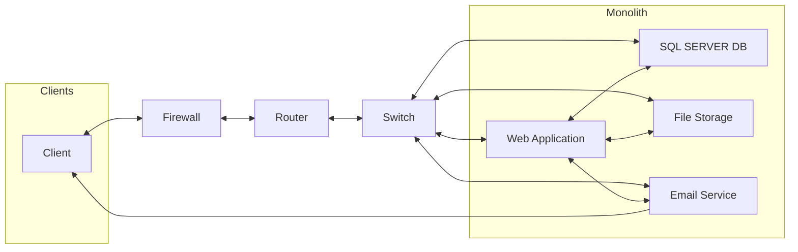

 # Cloud Migration and Cloud Adoption – A Comparative Study of PaaS, IaaS, and SaaS Across Cloud Providers
 
 

## Section 1: On-Premises Solution Design

I) Design the current on-premises architecture.
  ### Some Assumptions
  - Only one region and zone
  - Traffic isn't global

 

When the **client** sends a request to the webservice: 
- The request goes through a **firewall** (for security) 
- Then it reaches the **router** (which is what connects the web application to the internet)
- Then moves to the **switch** which directs the reqest to the **Web Application**. 
- The request is fulfilled and a response is sent back (or the **web application** notifies the **email server** which then sends an email to the **client**) 
- When fulfilling the client request, the web application might need to pull data from the **DB** or **local file storage** (such as images).

II) Identify key components that need to be migrated, specifying whether they would fit into PaaS, IaaS, or SaaS offerings.

| COMPONENT        | SERVICE MODEL |
|----------------  |---------------|
| Web Application  | PaaS          |
| Backend database | Paas          |
| File storage     | PaaS          |
| Basic networking | Iaas          |
| email services   | Saas          |

## Section 2: Migration Strategies

I) Propose migration strategies for each of the on-premises components:

| COMPONENT        | SERVICE MODEL | MIGRATION STRATERGY |
|----------------  |---------------| --------------------|
| Web Application  | PaaS          |Replatform: Allow quick transition and give time for full refactor later |
| Backend database | PaaS          |Replatform: Since cloud has SQL Server available, only minimal changes needed          |
| File storage     | PaaS          |Replatform: Easy transition to cloud version by moving files over.     |
| Basic networking | Iaas          |Refactor: Cloud Networking is different than on-prem.    |
| email services   | Saas          |Repurchase: Replace with a SaaS option.   |

II) Consider a hybrid approach for migration (e.g., migrating the web application to PaaS while keeping the database on IaaS initially).

### If the DB had to be IaaS

| COMPONENT        | SERVICE MODEL | MIGRATION STRATERGY |
|----------------  |---------------| --------------------|
| Web Application  | PaaS          |Replatform: Allow quick transition and give time for full refactor later |
| Backend database | IaaS          |Rehost: Create a VM and install SQL Server and dependencies to be managed by team.
| File storage     | PaaS          |Replatform: Easy transition to cloud version by moving files over.     |
| Basic networking | Iaas          |Refactor: Cloud Networking is different than on-prem.    |
| email services   | Saas          |Repurchase/Retire: Replace with a SaaS option.   |

### If the DB had to be IaaS and email service remains on-prem

| COMPONENT        | SERVICE MODEL | MIGRATION STRATERGY |
|----------------  |---------------| --------------------|
| Web Application  | PaaS          |Replatform: Allow quick transition and give time for full refactor later |
| Backend database | IaaS          |Rehost: Create a VM and install SQL Server and dependencies to be managed by team.
| File storage     | PaaS          |Replatform: Easy transition to cloud version by moving files over.     |
| Basic networking | Iaas          |Refactor: Cloud Networking is different than on-prem.    |
| email services   | On-Prem       |Retain: No change other than to connect services to the others. |

III) Create a detailed migration plan, outlining the steps and decisions to be made during migration (rehosting, refactoring, Lift and Shift, etc.).

The migration will be executed in a [phased](https://www.k2view.com/blog/data-migration-plan/) approach. This is to ensure service is not distrubted while migrating.

We will begin with replatforming the web application into a managed PaaS environment, ensuring a quick transition while creating a foundation for a future refactor into microservices. 

The backend SQL Server database will also move to a PaaS offering, requiring only minimal configuration adjustments while gaining built-in scaling, backups, and high availability. 

The file storage will be replatformed into cloud-native file storage services, with existing files securely migrated in phases to minimize downtime. 

Networking will require a refactor, as the company must redesign its network to align with cloud VNets, subnets, routing, and security groups. 

Finally, the email service will be repurchased as a SaaS solution, retiring the on-prem mail server in favor of a managed provider to improve reliability, deliverability, and reduce operational overhead.