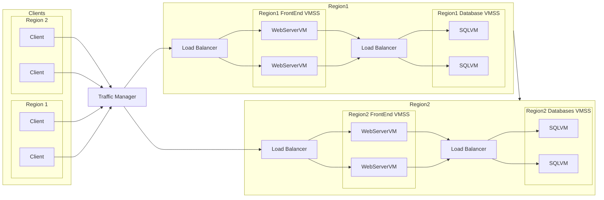

# Multi-Region Deployment with Load Balancing

## 1) A solution diagram showing the target architecture with load balancers and multi-region VMs.

## 2) A description of the target architecture highlighting redundancy and failover mechanisms.

### Traffic Manager (TM)
 - Acts as the global load balancer and entry point for all clients.
 - Distributes client requests across both regions (Region 1 and Region 2).
 - Uses [health probes](https://learn.microsoft.com/en-us/azure/traffic-manager/traffic-manager-monitoring) to detect regional outages and automatically route traffic to the healthy region.
 - Provides redundancy at the global level, ensuring users can always reach the application even if an entire region is offline.

### Regional Load Balancers (LB1 and LB3):
 - Each region has its own load balancer distributing traffic across a frontend VM scale set (VMSS).
 - This ensures intra-region redundancy: if one web server VM fails, traffic is automatically routed to healthy VMs within the same region.
 
### Frontend VM Scale Sets (FE1–FE4):
 - Each region hosts multiple WebServerVMs for serving static content.
 - Horizontal scaling ensures resilience against single-VM failures and accommodates traffic spikes.

### Database Load Balancers (LB2 and LB4):
 - Each region has a separate load balancer managing connections to its SQLVMs.
 - Provides redundancy for client connections within a region and can redirect queries to a healthy SQLVM instance.

### SQL VM Scale Sets (DB1–DB4):
 - Databases are replicated across regions (Region 1 and Region 2).
 - Within each region, two SQLVMs ensure high availability.
 - Between regions, asynchronous replication ensures that Region 2 has a warm standby copy of the database.
 - In the event of a regional SQL failure, Region 2 can be promoted to primary with minimal downtime.

The Region1 → Region2 connection in the diagram indicates database replication between regions.

## 3) The steps of migration:
### 1. Preparation & Assessment
  - Inventory current VMs (WebServerVM, SQLVM) and dependencies.
  - Define target regions for deployment (e.g., Region 1 as primary, Region 2 as secondary).
  - Plan downtime windows (since max downtime tolerated is 6 hours).

### 2. Replication of Virtual Machines Across Regions
  - Lift existing WebServerVM and SQLVM images into the cloud (using VM migration service or image export/import).

### 3. Configuration of Load Balancers
  - Congigure Traffic Manager to use health probes to detect regional outages
  
### 4. Implementation of Database Replication and Failover
  - Enable asynchronous replication from Region 1 SQLVMs to Region 2 SQLVMs